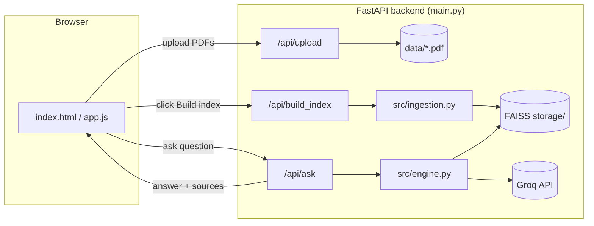

# RAG Chatbot - Web App (FastAPI + FAISS + Groq)

A chatbot that answers **any** question, with a dark-themed chat UI in the browser and a real
Python backend (not a demo toy):

- If your PDFs contain a relevant answer, it retrieves the passages, answers from them and shows sources.
- If not (or no PDFs indexed), it answers from the LLM's general knowledge.

| Part          | Tool                                        |
|---------------|----------------------------------------------|
| Parsing       | PyMuPDF                                     |
| Orchestration | LlamaIndex                                  |
| Vector DB     | FAISS (saved to `backend/storage/`)         |
| LLM           | Groq (`llama-3.3-70b-versatile`)            |
| Embeddings    | `BAAI/bge-small-en-v1.5` (local, free)      |
| Backend       | FastAPI (serves the API **and** the web UI) |
| Frontend      | Plain HTML/CSS/JS (no build step)           |

Your Groq API key stays on the **server** (`.env`), never exposed in the browser.

## Architecture



## The full process, step by step

### Phase 1 - Ingestion (offline)
Triggered by clicking **"Build index"** in the UI, or running `python ingest.py`.

| # | Step | Where |
|---|------|-------|
| 1 | Collect documents from `data/` | `collect_pdfs()` |
| 2 | Parse text page by page, keep `source` + `page` metadata | `parse_pdf()` (PyMuPDF) |
| 3 | Split into overlapping chunks (512 tokens, 64 overlap) | `SentenceSplitter` |
| 4 | Turn each chunk into a vector (embedding) | HuggingFace embedding model |
| 5 | Store vectors + text + metadata | FAISS `IndexFlatIP` -> `storage/` |

### Phase 2 - Query (online), for every chat message
| # | Step | Where |
|---|------|-------|
| 1 | User asks a question in the browser | `frontend/app.js` |
| 2 | Embed the question | `RAGEngine._retrieve()` |
| 3 | Similarity search in FAISS | `RAGEngine._retrieve()` |
| 4 | Keep top-K chunks whose cosine score >= `MIN_SCORE` | `RAGEngine.ask()` |
| 5 | Build prompt: excerpts + question (or just the question if nothing matched) | `RAGEngine.ask()` |
| 6 | Groq LLM generates the answer; sources + latency are returned as JSON | `RAGEngine.ask()` |

## Project structure
```
rag_web/
├── backend/
│   ├── main.py              FastAPI app: API routes + serves the frontend
│   ├── ingest.py            CLI: build the index from data/
│   ├── chat_cli.py          CLI: chat in the terminal
│   ├── evaluate.py          Run the test set and get metrics
│   ├── eval/questions.json  Test questions (edit this!)
│   ├── data/                Put your PDFs here
│   ├── storage/             FAISS index (auto-generated)
│   ├── src/
│   │   ├── config.py        Settings, prompts, model setup
│   │   ├── ingestion.py     Offline pipeline
│   │   └── engine.py        Online pipeline
│   ├── requirements.txt
│   └── .env.example
└── frontend/
    ├── index.html           Same dark chat UI
    ├── style.css
    └── app.js                Calls the backend API
```

## Setup and run
```bash
cd backend
pip install -r requirements.txt

cp .env.example .env          # Windows: copy .env.example .env
# open .env and paste your Groq key (free: https://console.groq.com/keys)

uvicorn main:app --reload
```
Open **http://localhost:8000** — upload PDFs in the sidebar, click **Build index**, then chat.
The first run downloads the embedding model (~130 MB); after that it works offline for embeddings.

### Optional: terminal tools (no browser needed)
```bash
python ingest.py       # build the index from data/
python chat_cli.py     # chat in the terminal
```

## Evaluate (do this before your demo)
1. Open `backend/eval/questions.json`, replace the placeholder `doc` questions with 20-50 real
   questions from your PDFs (`expected_source` = PDF file name, `expected_keyword` = a word the
   answer must contain), and delete `"skip": true`.
2. `cd backend && python evaluate.py`
3. Reports: retrieval hit-rate, routing accuracy (PDF vs general knowledge), keyword pass-rate,
   latency; details saved to `backend/eval_results.csv`.

## Features
- **Streaming answers** — toggle "Stream answers word-by-word" in the sidebar. Uses Server-Sent
  Events (`/api/ask_stream`); turn it off to get the answer in one shot from `/api/ask`.
- **Chat history persistence** — every message is saved to the browser's `localStorage`. Reloading
  the page restores the conversation. "Clear chat" wipes it.
- **PDF delete** — click ✕ next to an indexed file in the sidebar to remove it, then click
  "Build index" again to apply the change. To replace a file, delete the old one and upload the new
  one with the same name before rebuilding.
- **Export chat** — "⬇ Export .txt" downloads the conversation as plain text. "🖨 Export PDF" opens
  the browser's print dialog (choose "Save as PDF") with a print-friendly layout (sidebar hidden).
- **Light / dark theme** — toggle with the 🌙/☀️ button top-right of the sidebar; the choice is
  remembered in `localStorage`.

## Deploy on Render (free hosting)

Render deploys from a **GitHub repo**, not a zip upload, so push this project to GitHub first:
```bash
cd rag_web
git init
git add .
git commit -m "RAG chatbot"
gh repo create rag-chatbot --public --source=. --push   # or push manually via GitHub's website
```

Then on [render.com](https://render.com):
1. **New → Blueprint**, connect your GitHub repo (this project already includes `render.yaml`,
   so Render auto-fills the build/start commands).
2. When asked, paste your `GROQ_API_KEY` in the environment variable field (it is intentionally
   **not** committed to git — Render asks for it at deploy time).
3. Click **Apply** / **Create**. First deploy takes a few minutes (installs `faiss-cpu`,
   `llama-index`, downloads the embedding model).
4. Your app is live at `https://rag-chatbot-xxxx.onrender.com`.

No `render.yaml`? Set these manually when creating a Web Service:
- **Root Directory**: `backend`
- **Build command**: `python -m pip install -r requirements.txt`
- **Start command**: `python -m uvicorn main:app --host 0.0.0.0 --port $PORT`
- **Environment variable**: `GROQ_API_KEY` = your key

### Free-tier limitations (important for your demo)
- **Sleeps after 15 min of inactivity** — the next request takes ~30-50s to wake up. Open the app
  a minute before your demo starts.
- **Disk is not persistent on the free plan** — uploaded PDFs and the FAISS index in `storage/`
  are lost whenever the service restarts or redeploys. Two ways to handle this:
  - *Simplest*: commit a few PDFs into `backend/data/` in your repo, and call
    `POST /api/build_index` (or open the app and click "Build index") once after each deploy/wake-up.
  - *Permanent*: upgrade to a paid plan and attach a **Persistent Disk** mounted at
    `backend/storage` and `backend/data`, so the index survives restarts.
- Render's free plan gives limited CPU — embedding a large PDF set can be slow; keep `data/` small
  for a live demo, or pre-build `storage/` locally and commit it (only works if you skip the
  "disk isn't persistent" issue above, which committing a pre-built index sidesteps entirely).

## Tuning (in `backend/.env`)
| Setting | Default | Change when... |
|---|---|---|
| `MIN_SCORE` | 0.55 | Answers ignore your PDFs too often -> lower (0.45). Irrelevant PDF text used -> raise (0.65). The UI's "Match strictness" slider does this live, per question. |
| `TOP_K` | 4 | Use the smallest number that works; too many chunks confuse the LLM. |
| `CHUNK_SIZE` / `CHUNK_OVERLAP` | 512 / 64 | Re-index after changing (`python ingest.py`). |
| `EMBED_MODEL` | bge-small-en-v1.5 | Tamil/multilingual PDFs: `BAAI/bge-m3`. Re-index after changing. |
| `GROQ_MODEL` | llama-3.3-70b-versatile | If Groq rejects the name, check console.groq.com/docs/models. |

## Common mistakes to avoid
- Chunks too large or too small.
- Not checking that PDF text was extracted properly (scanned PDFs return no text; they need OCR).
- Trusting retrieval blindly - always run `evaluate.py`.
- Committing `.env` (your API key) to GitHub. It is already in `.gitignore`.

## Demo checklist
- [ ] Documents parse correctly (Build index shows pages > 0)
- [ ] Chunks preserve context
- [ ] Vector search retrieves relevant text (check sources under each answer)
- [ ] Prompt actually contains retrieved context
- [ ] Answers show sources
- [ ] General / unknown questions are handled sensibly
- [ ] API key not committed
- [ ] README explains the architecture
- [ ] Works from a clean setup (fresh clone -> install -> run -> demo)

## Limitations
- Only text PDFs (no OCR, no DOCX yet).
- Follow-up questions search using only the latest message, so very short follow-ups
  ("and its fee?") may retrieve poorly.
- Free-tier Groq has rate limits; `evaluate.py` pauses 2s between questions.
